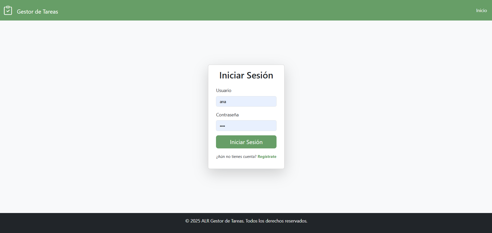
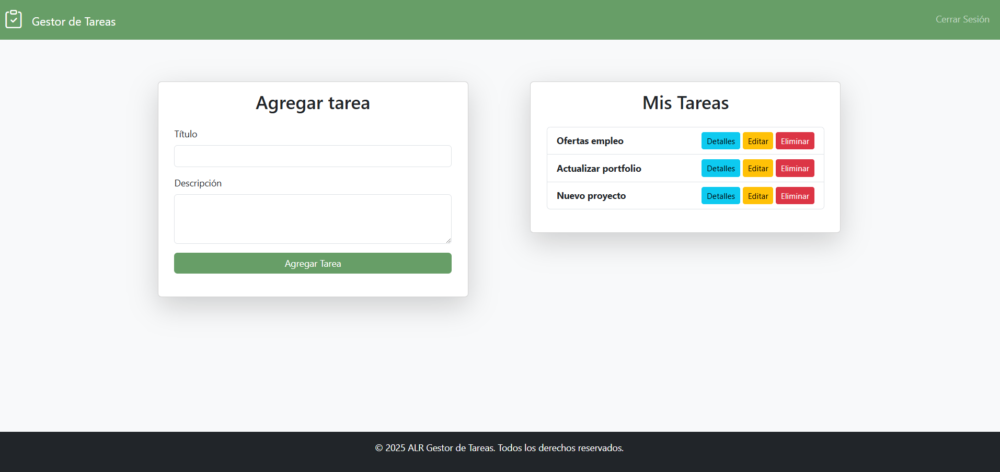

# 📌 Gestor de Tareas ✅

## 📝 Descripción

Este es un **Gestor de Tareas** desarrollado en PHP siguiendo el **patrón MVC** (Modelo-Vista-Controlador). La aplicación permite a los usuarios registrarse e iniciar sesión para gestionar sus tareas de forma personalizada. Cada usuario puede ver, agregar, editar y eliminar sus propias tareas.

## 🚀 Características

- **Autenticación de Usuarios**: Registro e inicio de sesión.
- **Gestor de Tareas**: Cada usuario puede administrar sus propias tareas.
- **Operaciones CRUD**:
  - Crear nuevas tareas.
  - Editar tareas existentes.
  - Eliminar tareas.
  - Listar las tareas en un panel principal.
- **Arquitectura MVC**: Separación del código en modelos, vistas y controladores.

## 🛠️ Tecnologías Utilizadas

- **Lenguaje**: PHP
- **Base de Datos**: MySQL
- **Servidor Web**: WAMP / XAMPP / LAMP
- **Front-End**: HTML, CSS, JavaScript, Bootstrap

## 📂 Estructura del Proyecto

```
mini-app/
│── config/
│   ├── database.php (Conexión a la base de datos)
│── controllers/
│   ├── AuthController.php (Manejo de login y registro)
│   ├── TaskController.php (Manejo de tareas)
│── models/
│   ├── User.php (Modelo de usuario)
│   ├── Task.php (Modelo de tarea)
│── views/
│   ├── login.php (Formulario de login)
│   ├── register.php (Formulario de registro)
│   ├── dashboard.php (Vista principal con tareas)
│── assets/
│   ├── css/
│   ├── js/
│   ├── sql/
│── index.php (Punto de entrada de la aplicación)
```

## 📸 Vistas de la Aplicación




## ⚙️ Instalación y Configuración

1. **Clonar el repositorio**

   ```bash
   git clone https://github.com/tu-repositorio/mini-app.git
   ```

2. **Configurar la base de datos**
   - Importa el archivo `gestor_tareas.sql` en tu servidor MySQL.
   - Asegúrate de que las credenciales de la base de datos en `config/database.php` sean correctas.
3. **Iniciar el servidor local**
   - Si usas WAMP/XAMPP, coloca el proyecto en `www` o `htdocs`.
   - Accede desde el navegador: `http://localhost/mini-app/`

## 🎯 Uso

1. Regístrate con un nuevo usuario.
2. Inicia sesión.
3. Gestiona tus tareas:
   - Agregar nuevas tareas.
   - Editar tareas existentes.
   - Eliminar tareas cuando ya no sean necesarias.
